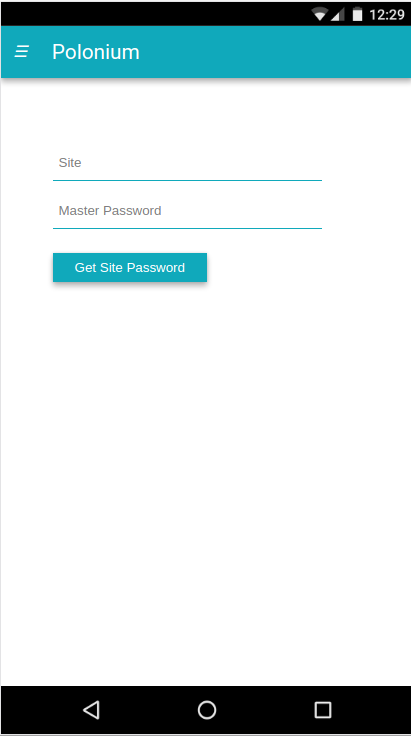

# Polonium Site

[](http://inch-ci.org/github/rgrannell1/Polonium-Site)



##
```
Usage:                                                                                                     
    build new [ssh_key]                                                                                    
    build test [lint_js]                                                                                   
    build run [local_server]                                                                               
    build deploy [remote_server]                                                                           
See build -h/--help for more information
```
